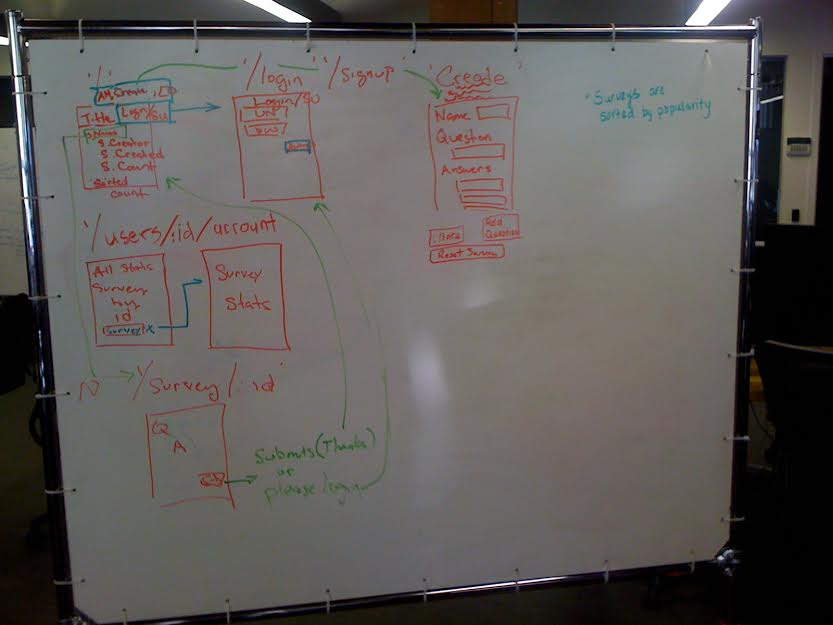
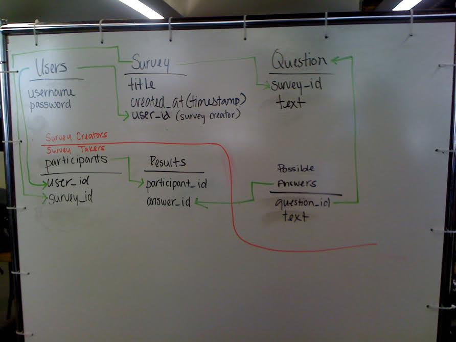

#Starting the app

Below is a list of the magic words you need to start the app. 

```
bundle install
rake db:create
rake db:migrate
rake db:seed
shotgun
```


#Common errors: 

## no acceptor (port is in use or requires root privileges)


```
Taras-MacBook-Air:SurveyDBCGroupProject tlroys$ shotgun
== Shotgun/Thin on http://127.0.0.1:9393/
Thin web server (v1.6.1 codename Death Proof)
Maximum connections set to 1024
Listening on 127.0.0.1:9393, CTRL+C to stop
/Users/tlroys/.rvm/gems/ruby-1.9.3-p484/gems/eventmachine-1.0.3/lib/eventmachine.rb:526:in `start_tcp_server': no acceptor (port is in use or requires root privileges) (RuntimeError)
  from /Users/tlroys/.rvm/gems/ruby-1.9.3-p484/gems/eventmachine-1.0.3/lib/eventmachine.rb:526:in `start_server'
  from /Users/tlroys/.rvm/gems/ruby-1.9.3-p484/gems/thin-1.6.1/lib/thin/backends/tcp_server.rb:16:in `connect'
  from /Users/tlroys/.rvm/gems/ruby-1.9.3-p484/gems/thin-1.6.1/lib/thin/backends/base.rb:63:in `block in start'
  from /Users/tlroys/.rvm/gems/ruby-1.9.3-p484/gems/eventmachine-1.0.3/lib/eventmachine.rb:187:in `call'
  from /Users/tlroys/.rvm/gems/ruby-1.9.3-p484/gems/eventmachine-1.0.3/lib/eventmachine.rb:187:in `run_machine'
  from /Users/tlroys/.rvm/gems/ruby-1.9.3-p484/gems/eventmachine-1.0.3/lib/eventmachine.rb:187:in `run'
  from /Users/tlroys/.rvm/gems/ruby-1.9.3-p484/gems/thin-1.6.1/lib/thin/backends/base.rb:73:in `start'
  from /Users/tlroys/.rvm/gems/ruby-1.9.3-p484/gems/thin-1.6.1/lib/thin/server.rb:162:in `start'
  from /Users/tlroys/.rvm/gems/ruby-1.9.3-p484/gems/rack-1.5.2/lib/rack/handler/thin.rb:16:in `run'
  from /Users/tlroys/.rvm/gems/ruby-1.9.3-p484/gems/shotgun-0.9/bin/shotgun:156:in `<top (required)>'
  from /Users/tlroys/.rvm/gems/ruby-1.9.3-p484/bin/shotgun:23:in `load'
  from /Users/tlroys/.rvm/gems/ruby-1.9.3-p484/bin/shotgun:23:in `<main>'
  from /Users/tlroys/.rvm/gems/ruby-1.9.3-p484/bin/ruby_executable_hooks:15:in `eval'
  from /Users/tlroys/.rvm/gems/ruby-1.9.3-p484/bin/ruby_executable_hooks:15:in `<main>'
```

This is caused by the fact that the last time you had a server running, you closed the terminal without killing the server.  I believe this is called 'running headless', like a chicken with it's head cut off.  So even though nobody is around watching, the server is still running and taking up the 'space' called port 9393. When you try to start a new server, there is already one running. It's kind of like a parking spot: since there is already a car there, you can't part a new one in the same spot. 

You can call the tow truck to get rid of it. 

To find out the license plate number of the car, run the following set of [commands I found on Stack Overflow](http://stackoverflow.com/a/11973828/1344732) 

```
ps ax | grep sinatra
95704 s002  R+     0:00.00 grep ruby
```

This finds the process id, aka the license plate number of the 'car' occupying the 'parking spot.' Note: the server occupying my 'spot' is in fact a server written using the programming language ruby: sort of like some cars are Chevorlets. I can tell the person finding out the licenseplate number to look for the chevrolet, and he will find the right car as long as there are no other cars around. Since this 'zombie server' is the only ruby process running on my computer, telling the grep commadn to look for ruby will give the right process id/ license plate numbers.

The first five numbers are the process id. 

Then run the command 

```
kill -9 95704
```


You'll have to chage the 95704 to the actuall process id, but you get the idea. The towtruck has come, dragged teh car away to the junkyard, and left the spot free for me to use. 

-----------------------


#Step 1: Wireframing



1. '/' Index page:
   - navigation: login/signup
      -when user is logged in, the nav changes to account management, create survey, and logout
   - Shows a list of all surveys
     -Each survey shows
        -Survey creator,
        -Survey created
        -Survey count
        -Survey is a link to the page for that survey
   This is sorting somehow.

Kevin will teach partials, and also will help us make the
login form modal.

2. '/login' (partial)
  - login form
   - username
   - password
   - submit buton

3. '/signup' (partial)
   - copy of sign-in

4. '/users/user_id/account_management'
  - nav bar
  - landing page for reporting and statistics
  - ignore user profile (don't change name or password)
  - list of surveys created

5. 'Statistics page for surveys'
  -This is a dummy page

6. 'What is the resful way to create page route'
  - Survey has a name
  - Survey has a list of already created questions
  - Survey has a question form
    - Question
    - Set of answers
  - Create Question button
  - Kill survey button

7. 'survey/id '
  - Display survey
    - submit button

8. Thank you for taking survey!
  - Button that redirects to main page

----------------------------------------------------------

#Schema



1. Users
  - id
  - name
  - password
  - timestamps

2. Survey
  - title
  - created_at(timestamp)
  - user_id

3. Question
  - survey id
  - content

4. Possible Answers table
 - question_id
 - text

5. Participant
 - user_id
 - survey_id

6. Results
 - participants_id
 - answers_id


--------------------------------------------------------
#Survey Gorilla Challenge

We're going to build a survey application that lets users create their own multiple-choice polls and other users to vote in them.

This is going to use a combination of pure JavaScript and AJAX to achieve the desired effects.

A survey will have many questions. Each question will have many possible responses. A voter will select one (and only one) response for each question in a survey.

##Objectives

###Models
Go back to the polling schema challenges. This schema will be fairly complex and it will help to think in terms of survey-creators versus survey-voters.

There should be at least 6 core models/tables. You'll need a table to hold rows that represent the following sort of facts:

1. User A exists
2. User A created Survey X
3. Question Y belongs to Survey X
4. Possible Choice Z belongs to Question Y
5. User B completed Survey X
6. User B chose Possible Choice Z for Question Y

Each of these should correspond to a single table in your database and a single model in your app.Users need to be signed in to create a survey and vote in a survey.

###Wireframes
Work through wireframes and discuss what your core pages are and what your core user flows are.

There should be two _core flows_: survey creation and survey completion.
One possible division of labor would be to separate these two flows.

###Survey Creation
Users will want to create their surveys in "one go" by adding multiple questions and choices per question on a single page. This is an opportunity to create some fun _dynamic forms_. Check these out:

- [Adding Form Fields Dynamically with jQuery](http://www.mustbebuilt.co.uk/2012/07/27/adding- form-fields-dynamically-with-jquery/)
- [Dynamically Add Input Fields To Form Using jQuery](http://www.infotuts.com/dynamically-add- input-fields-to-form-jquery/)

Google "_jquery dynamic form fields_" to find more.

To start and for your own sanity, maybe limit each survey to a single question. Create a version with a single question per survey working first and add support for multiple questions later.
Surveys should also have an optional image associated with them. [CarrierWave] (https://github.com/jnicklas/carrierwave) is your friend; you'll come to love it with time.

###Survey Taking

For now, a user has to answer every question in a survey. You should be able to implement this constraint using a _single custom validation_ on a single model.

###Survey Results

Create a nice page that shows the survey creator the results of a survey. If you want to do something fancy, try using [_d3.js_](http://d3js.org/). This is very advanced.
There are other charting libraries like [_Flot_](http://www.flotcharts.org/) or [_Highcharts_] (http://www.highcharts.com/).

At the very least, create some _simple HTML bar charts_ by having percentage-width divs with a fixed height and solid background color so that we can see how people responded for each question in a particular survey.

###Advanced Features

If you're looking for more advanced features, how about something that lets a user view a survey without logging in but pops up a [_modal dialog_](http://www.ericmmartin.com/projects/simplemodal/) to prompt a user to _sign in/sign up_ right before they vote?

How about _more advanced visualizations_, like time series? How about focusing on making the user interface really nice? How about multiple question types?
